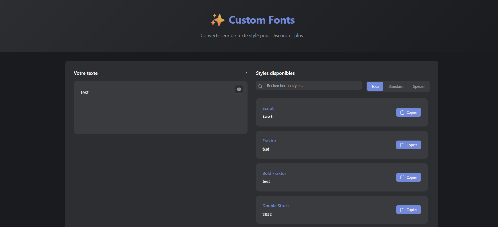

# Custom Fonts 🔤


Un convertisseur de texte moderne et élégant qui transforme votre texte en différents styles typographiques uniques. Parfait pour personnaliser vos messages sur Discord, Twitter, Instagram et autres plateformes sociales.



## ✨ Fonctionnalités

### 🎨 Styles disponibles
- **Script** - 𝓣𝓮𝔁𝓽𝓮 𝓮𝓷 𝓼𝓬𝓻𝓲𝓹𝓽
- **Fraktur** - 𝔗𝔢𝔵𝔱𝔢 𝔢𝔫 𝔣𝔯𝔞𝔨𝔱𝔲𝔯
- **Bold Fraktur** - 𝕿𝖊𝖝𝖙𝖊 𝖊𝖓 𝖋𝖗𝖆𝖐𝖙𝖚𝖗 𝖌𝖗𝖆𝖘
- **Double Struck** - 𝕋𝕖𝕩𝕥𝕖 𝕕𝕠𝕦𝕓𝕝𝕖
- **Sans Serif Bold** - 𝗧𝗲𝘅𝘁𝗲 𝘀𝗮𝗻𝘀 𝘀𝗲𝗿𝗶𝗳
- **Monospace** - 𝚃𝚎𝚡𝚝𝚎 𝚖𝚘𝚗𝚘𝚜𝚙𝚊𝚌𝚎
- **Small Caps** - ᴛᴇxᴛᴇ ᴇɴ ᴘᴇᴛɪᴛᴇs ᴄᴀᴘɪᴛᴀʟᴇs
- **Circled** - Ⓣⓔⓧⓣⓔ ⓔⓝⓒⓔⓡⓒⓛé
- Et plus de 10 autres styles !

### 🚀 Caractéristiques techniques
- ⚡ Conversion en temps réel
- 📱 Interface responsive (mobile-first)
- 🌙 Support du mode sombre/clair
- 🔍 Recherche et filtrage des styles
- 📋 Copie en un clic avec feedback visuel
- ⌨️ Raccourcis clavier
- ♿ Accessible (ARIA labels, navigation clavier)
- 🎯 Aucune dépendance externe
- 🔒 Respect de la vie privée (aucune donnée collectée)

## 📦 Installation

### Option 1 : Cloner le repository
```bash
git clone https://github.com/Nyx-Off/CustomFonts.git
cd CustomFonts
```

### Option 2 : Télécharger le ZIP
1. Cliquez sur le bouton "Code" → "Download ZIP"
2. Décompressez l'archive
3. Ouvrez le dossier

### Option 3 : Utiliser npm (pour développeurs)
```bash
npm install
npm run dev
```

## 🚀 Utilisation

### Utilisation basique
1. Ouvrez `public/index.html` dans votre navigateur
2. Tapez ou collez votre texte dans la zone de saisie
3. Les conversions apparaissent automatiquement
4. Cliquez sur "Copier" pour copier le style souhaité

### Raccourcis clavier
- `Ctrl/Cmd + K` : Focus sur la zone de texte
- `Escape` : Effacer le texte
- `Ctrl/Cmd + Enter` : Défocus de la zone de texte

## 🏗️ Architecture du projet

```
custom-fonts/
├── public/              # Fichiers statiques publics
│   └── index.html      # Point d'entrée HTML
├── src/                # Code source
│   ├── assets/         # Ressources (CSS, images)
│   │   ├── styles/     # Fichiers CSS modulaires
│   │   └── images/     # Images et captures
│   ├── js/            # Code JavaScript
│   │   ├── app.js     # Application principale
│   │   ├── components/# Composants UI
│   │   ├── converters/# Logique de conversion
│   │   └── config/    # Configuration
│   └── data/          # Données statiques
├── tests/             # Tests unitaires
├── docs/              # Documentation
└── README.md          # Ce fichier
```

## 🛠️ Développement

### Prérequis
- Node.js 14+ (optionnel, pour les outils de développement)
- Un navigateur moderne
- Un éditeur de code

### Structure des composants

#### `TextInput`
Gère la saisie utilisateur avec :
- Auto-resize du textarea
- Compteur de caractères
- Bouton d'effacement
- Gestion des événements

#### `OutputDisplay`
Affiche les résultats avec :
- Liste des conversions
- Recherche en temps réel
- Filtres par catégorie
- Animation des items

#### `FontConverter`
Moteur de conversion :
- Mappings Unicode
- Convertisseurs spéciaux
- API extensible

### Ajouter un nouveau style

1. Éditez `src/js/config/fontStyles.js` :
```javascript
export const fontStyles = {
    "Mon Style": {
        'a': '𝓪', 'b': '𝓫', // etc...
    }
};
```

2. Ou ajoutez un convertisseur spécial dans `src/js/converters/additionalConverters.js` :
```javascript
{
    name: "Mon Convertisseur",
    convert: (text) => {
        // Logique de conversion
        return textConverti;
    }
}
```

## 🧪 Tests

```bash
npm test                 # Lancer tous les tests
npm run test:watch      # Mode watch
npm run test:coverage   # Rapport de couverture
```

## 📱 Support des navigateurs

- ✅ Chrome 80+
- ✅ Firefox 75+
- ✅ Safari 13+
- ✅ Edge 80+
- ✅ Opera 67+
- ⚠️ Internet Explorer (non supporté)

## 🤝 Contribution

Les contributions sont les bienvenues ! Voici comment participer :

1. Fork le projet
2. Créez votre branche (`git checkout -b feature/AmazingFeature`)
3. Committez vos changements (`git commit -m 'Add AmazingFeature'`)
4. Push vers la branche (`git push origin feature/AmazingFeature`)
5. Ouvrez une Pull Request

### Guidelines
- Respectez la structure du projet
- Ajoutez des tests pour les nouvelles fonctionnalités
- Mettez à jour la documentation
- Suivez les conventions de code existantes

## 📄 Licence

Ce projet est sous licence MIT. Voir le fichier [LICENSE](LICENSE) pour plus de détails.

## 👤 Auteur

**Samy - Nyx**
- GitHub: [@Nyx-Off](https://github.com/Nyx-Off)

## 🙏 Remerciements

- Inspiration des convertisseurs de texte Discord
- La communauté open source
- Les contributeurs du projet

## 📊 Statistiques


---

⭐ N'hésitez pas à mettre une étoile si ce projet vous a été utile !